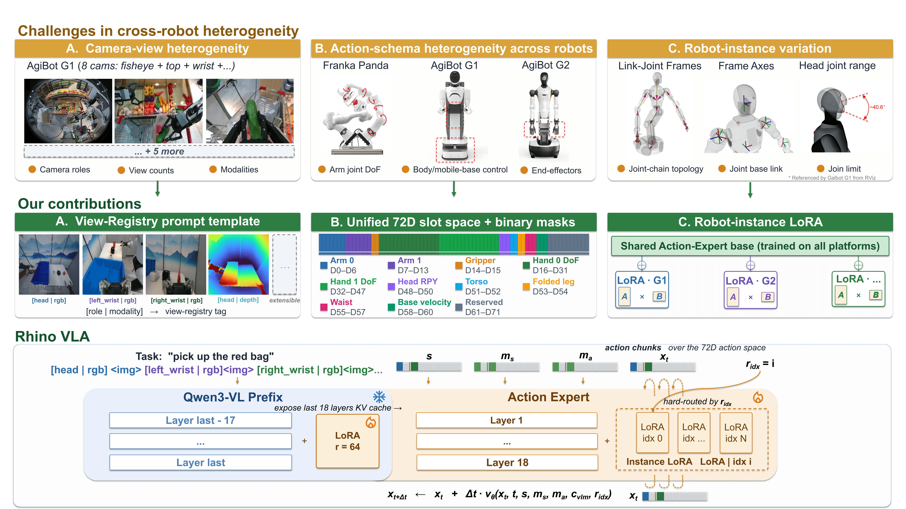

<p align="center">
  
</p>

<h1 align="center">
  
  RhinoVLA
</h1>

<p align="center">
  
  <a href="https://arxiv.org/abs/2606.07383"></a>
</p>

<p align="center">
  <a href="./README.md">中文</a> |
  <b>English</b> |
  <a href="https://arxiv.org/abs/2606.07383">Paper</a>
</p>

<p align="center">
  <b>A cross-embodiment Vision-Language-Action model for real-time robot control on edge AI chips</b>
</p>

RhinoVLA is a self-developed cross-embodiment VLA system from Huixi AI, designed for real-time robot control on edge devices. The technical report presents a model-chip-robot deployment stack built with RhinoVLA, the Huixi R1 chip, and real robots from AgiBot and Galbot.

RhinoVLA reaches **11.69Hz** end-to-end inference on the Huixi R1 chip, crossing the 10Hz threshold commonly used for real-time robot closed-loop control. It also supports transfer across different robot platforms through a unified state-action interface and lightweight instance adaptation.

## Key Features

- **Real-time edge deployment**: designed for robot-side VLA inference on the Huixi R1 chip.

- **Algorithm-system co-optimization**: combines a Qwen3-VL Backbone, an Action Expert, and chip/runtime optimization for lower edge-side cost.

- **Cross-embodiment adaptation**: uses View Registry, a 72D state-action interface, and Instance LoRA to handle visual-input, action-interface, and robot-instance differences.

<p align="center">
  
</p>

## 🎬 Demo

RhinoVLA has been demonstrated on multiple real robot platforms:

### Galbot G1: Instruction following

RhinoVLA runs on Galbot G1 with the Huixi R1 chip and executes three natural-language instructions.

<div align="center">
  <video src="https://github.com/user-attachments/assets/5cc67652-53a8-49a0-a38c-08ae5fc38f68" width="100%" controls></video>
</div>

### AgiBot G2: Long-horizon task

RhinoVLA runs on AgiBot G2 with the Huixi R1 chip and completes a multi-step task from one long instruction.

<div align="center">
  <video src="https://github.com/user-attachments/assets/04499b63-fefd-498d-8bd2-fdab28c1c2dd" width="100%" controls></video>
</div>

### AgiBot G1: Bimanual towel folding

RhinoVLA runs on AgiBot G1 with the Huixi R1 chip and completes a bimanual deformable-object task.

<div align="center">
  <video src="https://github.com/user-attachments/assets/de229167-6e2d-4e5c-849c-334d9d6800ab" width="100%" controls></video>
</div>

## 📦 Release Plan

The repository is being organized and will progressively release:

- [ ] Model training code
- [ ] Model parameters
- [ ] Training and evaluation datasets

## 📄 Citation

If RhinoVLA is helpful for your research, please cite our technical report:

```bibtex
@misc{intelligence2026rhinovlatechnicalreport,
      title={RhinoVLA Technical Report}, 
      author={Huixi Intelligence and Chen Zhang and Chenyang Zhou and Guanglei Ding and Guanghui He and Haibin Gao and Jiajia Chen and Jianyong Zhang and Lianyi Yu and Ningyi Xu and Ping Xu and Qingchen Li and Yingjun Hu and Yijia Zhang and Yuxi Liu},
      year={2026},
      eprint={2606.07383},
      archivePrefix={arXiv},
      primaryClass={cs.RO},
      url={https://arxiv.org/abs/2606.07383}, 
}
```

## ⚖️ License

This project is released under the Apache-2.0 License.

## 💬 Contact

WeChat Official Account:

<p align="left">
  
</p>
